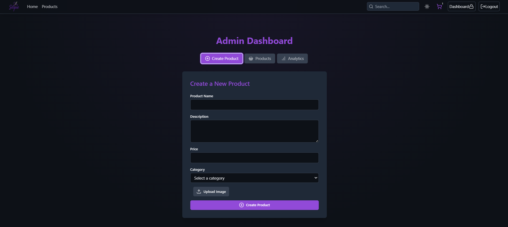
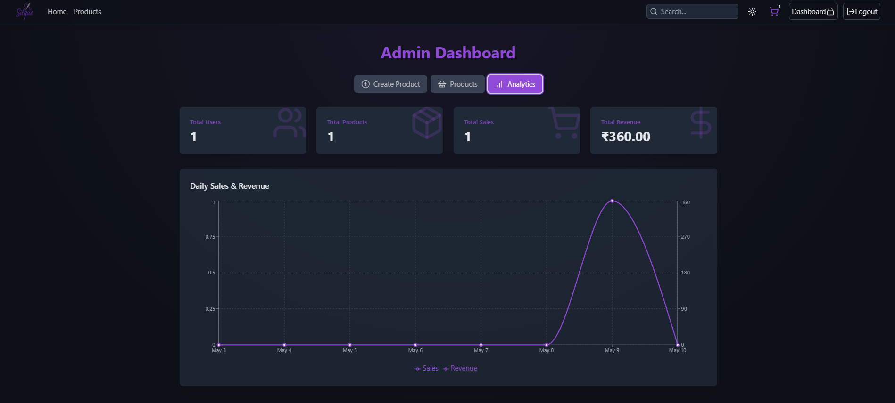

# Silque

A full-stack e-commerce web application built with **Node.js**, **Express**, **MongoDB**, and **React** (Vite + Tailwind CSS). Silque offers browsing, cart management, coupon codes, secure payments, and an admin dashboard with analytics.

---

## Table of Contents

- [Project Structure](#project-structure)
- [Features](#features)
- [Screenshots](#screenshots)
- [Getting Started](#getting-started)
  - [Prerequisites](#prerequisites)
  - [Clone the Repo](#clone-the-repo)
  - [Environment Variables](#environment-variables)
  - [Install Dependencies & Run](#install-dependencies--run)
- [Deployment](#deployment)
- [License](#license)

---

## Project Structure

```bash
Silque/
├── backend/                  # REST API server (Node.js + Express)
│   ├── controllers/          # Route handlers
│   ├── lib/                  # Cloudinary, Stripe, DB, Redis setup
│   ├── middleware/           # Authentication middleware
│   ├── models/               # Mongoose schemas
│   ├── routes/               # Express routes
│   └── server.js             # Entry point
├── frontend/                 # React client (Vite + Tailwind)
│   ├── public/               # Static assets & product images
│   ├── src/                  # App code (components, pages, stores, lib)
│   ├── index.html
│   ├── tailwind.config.js
│   └── vite.config.js        # Dev server config
├── package.json              # Root scripts & dependencies
└── README.md                 # This file
```

---

## Features

- Responsive UI with Tailwind CSS
- Browse products by category
- Search and filter products
- Add/remove items from cart
- Secure Stripe payment integration
- Coupon code promotion support
- User authentication (signup/login)
- User profile & order history
- Recommended products (People Also Bought)
- Admin dashboard:
  - Product management (create/update/delete)
  - Sales & user analytics
  - Coupon management

---

## Screenshots

<details>
  <summary>🔽 Screenshots</summary>

| Feature                | Screenshot                                              |
|------------------------|---------------------------------------------------------|
| Home Page              |                      |
| Category Page          |                  |
| Product Detail         |               |
| Cart & Checkout        |                          |
| Cart & Checkout        |                  |
| Purchase Success       |  |
| Purchase Cancel        |    |
| Admin Dashboard        |              |
| Create Product Form    |      |
| Analytics Tab          |                |
| Dark Theme             |             |
| Light Theme            |             |


</details>

---

## Getting Started

### Prerequisites

- Node.js (v16+)
- npm or yarn
- MongoDB instance (local or Atlas)
- Redis server

### Clone the Repo

```powershell
git clone https://github.com/your-username/silque.git
cd silque
```

### Environment Variables

Create a single `.env` file in the project root with the following:

```ini
PORT=5000
MONGO_URI=<your-mongodb-connection-string>
JWT_SECRET=<your-jwt-secret>
CLOUDINARY_CLOUD_NAME=<cloud_name>
CLOUDINARY_API_KEY=<api_key>
CLOUDINARY_API_SECRET=<api_secret>
STRIPE_SECRET_KEY=<stripe_secret_key>
REDIS_URL=<redis_connection_string>
VITE_API_URL=http://localhost:5000/api
```

### Install Dependencies & Run

```powershell
# Backend
cd backend
npm install
npm run dev

# In a new terminal, Frontend
cd frontend
npm install
npm run dev
```

Your apps will be running at:

- Backend API: http://localhost:5000/api
- Frontend: http://localhost:5173

---

## Deployment

### Backend

1. Push to a Git hosting (GitHub, GitLab).
2. Use platforms like **Heroku**, **Render**, or **AWS Elastic Beanstalk**.
3. Set the same env vars in platform settings.
4. Deploy via Git or CLI.

### Frontend

1. Build static files:
   ```powershell
   cd frontend
   npm run build
   ```
2. Host on **Netlify**, **Vercel**, or **Firebase Hosting**.
3. Point to `dist/` folder.

---

Made with ❤️ by [Prateek Kumar](https://github.com/PrateekKumar15)


